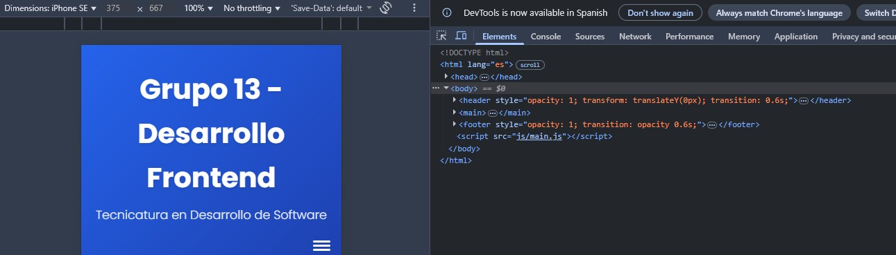

# Proyecto Frontend - Grupo 13

Este repositorio documenta las mejoras implementadas entre el sitio inicial  
[dsw-grupo13-kappa.vercel.app](https://dsw-grupo13-kappa.vercel.app/)  
y el sitio final  
[tp-3-frontend.vercel.app](https://tp-3-frontend.vercel.app/).

## 📑 Índice de Mejoras Implementadas
- [1. Animaciones Suaves en la Interfaz](#1-animaciones-suaves-en-la-interfaz)
- [2. Búsqueda y Filtrado en JSON Local](#2-búsqueda-y-filtrado-en-json-local)
- [3. Paginación en API Externa](#3-paginación-en-api-externa)
- [4. Galería de Imágenes Interactiva](#4-galería-de-imágenes-interactiva)
- [5. Barras de Progreso de Habilidades](#5-barras-de-progreso-de-habilidades)
- [6. Botones de Redes Sociales Animados](#6-botones-de-redes-sociales-animados)

---

## 1. Animaciones Suaves en la Interfaz
**Descripción:** Se agregaron transiciones al cargar tarjetas y efectos hover en botones.  
- **Antes: https://dsw-grupo13-kappa.vercel.app/**  
    
- **Después: https://tp-3-frontend.vercel.app/**  
  

---

## 2. Búsqueda y Filtrado en JSON Local
**Descripción:** Se implementó un buscador por texto y filtros por categoría.  
- **Antes: https://dsw-tp-2-grupo13.vercel.app/movies**  
    
- **Después:https://tp-3-frontend.vercel.app/movies**  
  

---

## 3. Paginación en API Externa
**Descripción:** Se añadieron botones de navegación y número de página actual/total.  |   
- **Antes: https://dsw-tp-2-grupo13.vercel.app/books**  
    
- **Después: https://tp-3-frontend.vercel.app/books**  
  

---

## 4. Galería de Imágenes Interactiva
**Descripción:** Se introdujo una nueva sección **Galería** con un grid de imagenes que al clickear muestran un lightbox con navegación.  
- **Antes:**  
  --- 
- **Después: https://tp-3-frontend.vercel.app/gallery**  
  

---

## 5. Barras de Progreso de Habilidades
**Descripción:** Adición de **Transiciones CSS Suaves** al cambiar entre Modo Claro y Oscuro.  
- **Antes:**  
    
- **Después:**  
  

---

## 6. Botones de Redes Sociales Animados
**Descripción:** Adición de **Iconos de redes sociales** con efectos al hover en el footer.  
- **Antes:**  
    
- **Después:**  
  