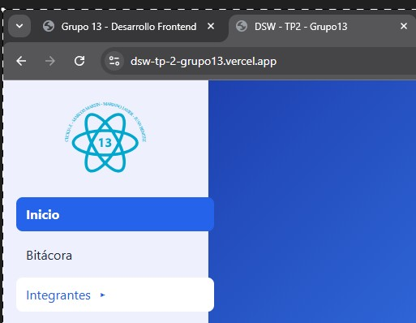
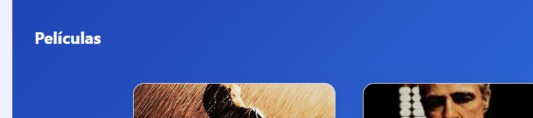
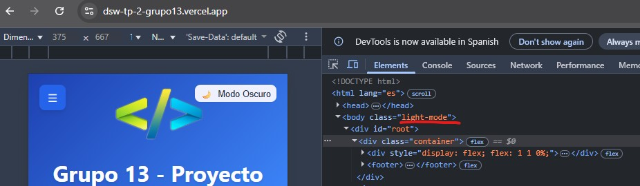

# DSW - TP3 / Evaluación Final - Grupo [***13***] 🚀

Este repositorio contiene la entrega final del Trabajo Práctico 3 (TP3), enfocada en la implementación de mejoras de **usabilidad**, **diseño responsivo** y **accesibilidad**.

| Elemento | Información |
| :--- | :--- |
| **Integrantes** | ***Marcos Martin***, ***Mariano Javier***, ***Julian Benitez***, ***Cecilia Fontenla*** |
| **Link a Vercel V2 (Final)** | [https://dsw-tp-2-grupo13.vercel.app/](https://dsw-tp-2-grupo13.vercel.app/) |
| **Link a Vercel V1 (Base)** | [https://dsw-grupo13-kappa.vercel.app/](https://dsw-grupo13-kappa.vercel.app/) |

---

## ✅ Requisito Obligatorio: Documentación de 5 Mejoras

A continuación, se documentan 5 mejoras implementadas en la **V2** (`dsw-tp-2-grupo13.vercel.app`) en contraste con la **V1** (`dsw-grupo13-kappa.vercel.app`).

### 1. 📂 Organización del Menú Lateral de Integrantes

| Detalle | |
| :--- | :--- |
| **Título/Descripción de la Mejora** | Implementación de menú **Acordeón/Desplegable** en la *Sidebar* para organizar sub-enlaces. |
| **Explicación** | En la V1, todos los enlaces (incluyendo los integrantes) estaban a la vista, sobrecargando la *Sidebar*. Se refactorizó la V2 para colapsar los sub-enlaces (ej. los nombres de integrantes) bajo un solo menú desplegable, **mejorando la limpieza y usabilidad** de la navegación. |
| **Capturas de Pantalla** | |
| **ANTES (Sidebar en V1)** |  |
| **DESPUÉS (Sidebar en V2)** |  |

---

### 2. 💨 Transición del Modo Oscuro

| Detalle | |
| :--- | :--- |
| **Título/Descripción de la Mejora** | Adición de **Transiciones CSS Suaves** al cambiar entre Modo Claro y Oscuro. |
| **Explicación** | El cambio de tema en la V1 era un "salto" abrupto (*instantáneo*), lo cual es visualmente incómodo. En la V2, se aplicó la propiedad `transition` a los elementos de color (texto, fondo), logrando un **efecto de *fade*** suave y profesional al alternar el modo. |
| **Capturas de Pantalla** | |
| **ANTES** (Descripción) | |
| **DESPUÉS** (Descripción) |  |

---

### 3. 🦶 Refactorización del Footer y Enlaces Sociales

| Detalle | |
| :--- | :--- |
| **Título/Descripción de la Mejora** | Estandarización del diseño del **Footer** con diseño en columnas y **enlaces sociales**. |
| **Explicación** | En la V1, el *Footer* era minimalista y carecía de estructura. La V2 mejoró la V1 al estructurar el *Footer* en **varias columnas** para la navegación y al integrar **iconos de redes sociales**, ofreciendo más funcionalidad y un diseño más completo. |
| **Capturas de Pantalla** | |
| **ANTES** (Vista Desktop/Móvil en V1) |  |
| **DESPUÉS** (Vista Desktop/Móvil en V2) |  |

---

### 4. 🎨 Mejora de Contraste en la Sidebar (Accesibilidad)

| Detalle | |
| :--- | :--- |
| **Título/Descripción de la Mejora** | Aumento de la **Accesibilidad y Contraste (WCAG AA)** en los elementos de la **Sidebar**. |
| **Explicación** | En la V1, la combinación de color de fondo y color de fuente de los enlaces inactivos tenía una baja relación de contraste. En la V2, se **ajustaron los tonos de gris y fondo** para cumplir con el estándar $\mathbf{4.5:1}$, haciendo el texto más nítido y legible. |
| **Capturas de Pantalla** | |
| **ANTES** (Vista Desktop/Móvil en V1) |  |
 |
| **DESPUÉS** (Vista Desktop/Móvil en V2) |  |

---

### 5. 🖼️ Inclusión de Iconografía en Navegación

| Detalle | |
| :--- | :--- |
| **Título/Descripción de la Mejora** | Integración de **Iconografía (ej. Font Awesome)** en los enlaces de la navegación principal para reconocimiento visual. |
| **Explicación** | La V1 dependía únicamente de texto plano para los enlaces. La V2 enriqueció la *Sidebar* al añadir un **icono temático** junto a cada enlace (ej. 🏠, 🎬, 🧑‍💻), lo que mejora la **experiencia visual** y permite al usuario identificar rápidamente la ruta deseada. |
| **Capturas de Pantalla** | |
| **ANTES** (Vista Desktop/Móvil en V1) |  |
| **DESPUÉS** (Vista Desktop/Móvil en V2) |  |

---

## 📖 Bitácora / Descripción de Cambios Clave

Las mejoras documentadas se centraron en la **Usabilidad** y el cumplimiento de **Estándares de Accesibilidad**.

* **Refactorización del Componente Sidebar:** El elemento de navegación principal fue refactorizado para soportar un menú tipo acordeón y la integración de iconos.
* **Mejora de la UX:** Se pulió la experiencia de usuario al utilizar transiciones suaves en el cambio de tema y al estructurar la información clave (Footer, Integrantes) de forma más organizada.
* **Cumplimiento de Diseño:** Las correcciones de contraste y la estandarización de elementos visuales (ej. Footer) garantizan una interfaz más profesional y accesible.
